  

 

 

### How it works

 

 

### By the numbers

 

 

### What Gate Apex catches

 

`prompt injection` · `jailbreaks` · `social engineering` · `data exfiltration` · `privilege escalation` · `CEO fraud` · `PII leaks` · `compound attacks` · `unicode evasion` · `multilingual exploits`

 

### What Gate Apex enforces

 

`risk scoring` · `ethical governance` · `ethical safeguards` · `adaptive thresholds` · `formal verification` · `cryptographic audit trail` · `threat intelligence` · `self-protection`

 

### Compliance-ready for

 

`EU AI Act` · `SOC 2` · `NIST AI RMF` · `IEC 61508` · `PIPEDA` · `ISO 42001`

 

 

### Built with

 

 

 

*Interested in AI safety, governance, or integrating Gate Apex?*

 

 

